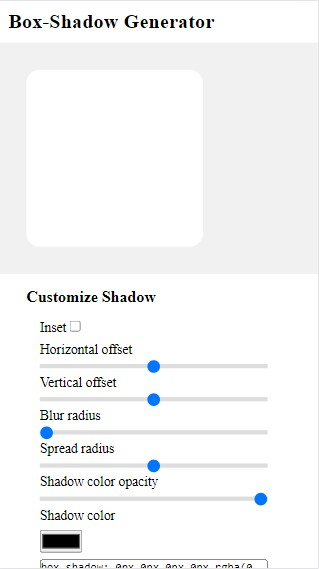
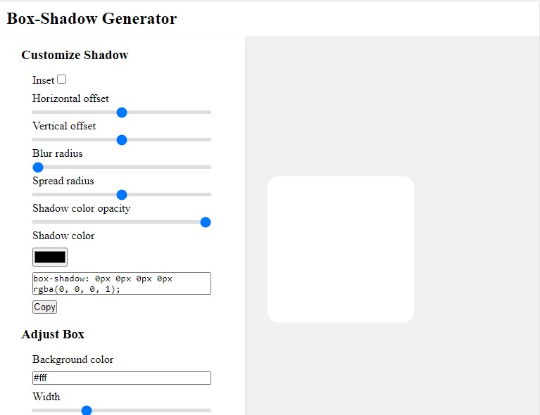
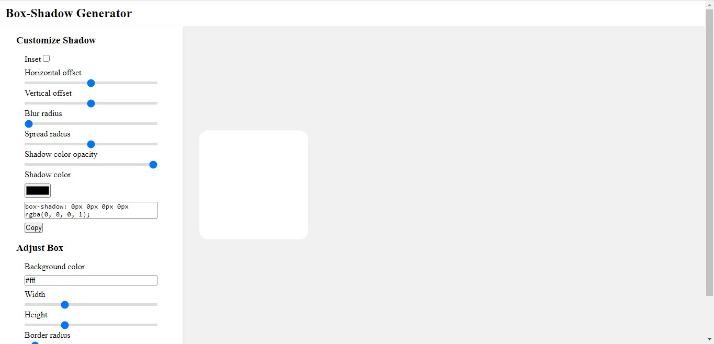

# Box Shadow Generator

Customize awesome box shadows and get the CSS code.

## Table of Contents

- [Overview](#overview)
  - [What is box shadow](#what-is-box-shadow)
  - [Live Site](#live-site)
- [My process](#my-process)
  - [HTML Structure](#html-structure)
  - [Responsiveness](#responsiveness)
    - [Small screen](#small-screen)
    - [Big screen](#big-screen)
  - [Event Listeners](#event-listeners)
  - [Copy code](#copy-code)
  - [Useful resources](#useful-resources)
- [Author](#author)

## Overview

### What is box Shadow?

The "box-shadow" is a CSS property that allows you to add shadow effects aroound an element's frame.

In the code below, the first and second value (6px and 10px) are the X and Y offsets. The third and fourth values (19px and -9px) are the blur and spread radius. The last is the color.

```css
.box {
  box-shadow: 6px 10px 19px -9px rgba(0, 0, 0, 0.7);
}
```


The keyword inset is used to specify to make the box-shadow inwards.

## Live Site

Live Site URL: https://create-box-shadow.netlify.app/

## My process

This app was built with HTML, CSS and JavaScript.
I would be talking about my process below.

## HTML Structure

Within the body tags, the HTML Structure is as thus:

- header
- main
  - section.box-center
    - div.box
  - section.customize
    - div.title
    - div.inputs-wrapper
      - label
      - input
      - textarea
      - copy

The input elements with type="range" have a min, value and max attribute set.

## Responsiveness

### Small screen

For smaller screens e.g smartphone



### Big screen

For wide screen sizes like iPad, Laptop and Desktop, the display is flex and flex order is reversed.

On iPads



On Laptops


## Event Listeners

All input elements are selected. For each of the input an event listener is added. The event listener works such that on input, the effect is seen on the box shadow or the box itself.

```js
inputs.forEach((input) => {
  input.addEventListener('input', () => {
    renderBox()
  })
})
```

## Copy code

```js
btn.addEventListener('click', () => {
  input.select()
  document.execCommand('copy')
  alert('code copied to your clipboard')
})
```

## Useful Resources

https://www.youtube.com/watch?v=9WZ4ajDNmrU&t=294s

## Author

- Website - https://pimiracle.w3spaces.com/
- Twitter - [@mimiDevs](https://www.twitter.com/mimiDevs)
